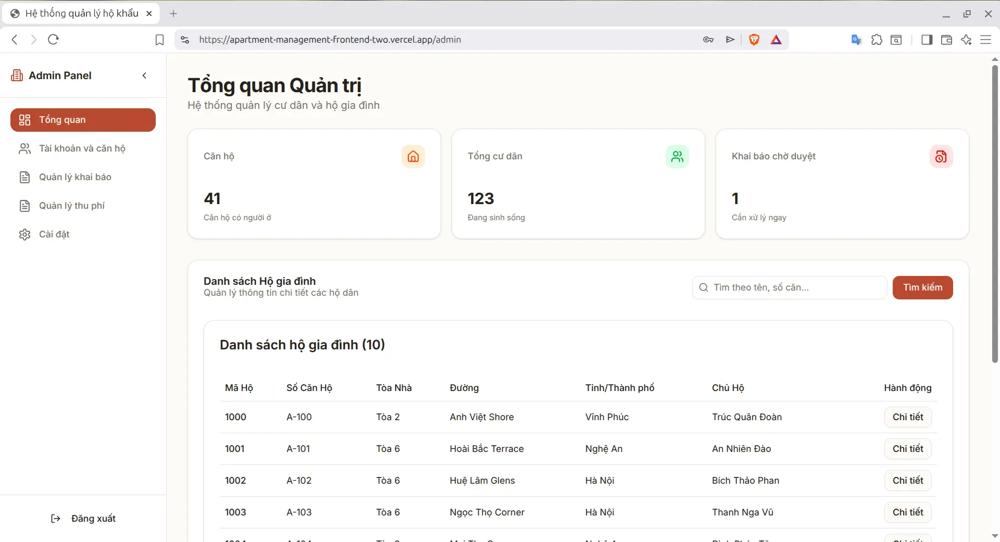

## Visuals


## Description

[Nest](https://github.com/nestjs/nest) framework TypeScript starter repository.

## Project structure

```
project-root/
├── .env                        # biến môi trường (DATABASE_URL, JWT_SECRET, v.v.)
│
├── prisma/
│   ├── schema.prisma           # khai báo model database (user, post,...)
│   ├── migrations/             # chứa migration do Prisma tạo
│   └── seed.ts                 # (tuỳ chọn) script để seed dữ liệu mẫu
│
└── src/
    ├── main.ts                 # bootstrap Nest app, enable ValidationPipe toàn cục
    ├── app.module.ts           # module gốc, import các module khác
    │
    ├── config/                 # cấu hình ứng dụng
    │
    ├── common/                  # code dùng chung, không thuộc module cụ thể
    │   ├── guards/              # RolesGuard, AuthGuard
    │   ├── decorators/          # @Roles(), @CurrentUser()
    │   ├── pipes/               # ParseIntPipe, ValidationPipe custom
    │   └── filters/             # ExceptionFilter, PrismaExceptionFilter
    │
    ├── shared/                     # code tái sử dụng trong nhiều module
    │   ├── prisma/
    │   │   └── prisma.service.ts   # PrismaService singleton
    │   ├── mailer/                 # MailService
    │   └── logger/                 # LoggerService
    │
    └── modules/                # các module chính
        ├── auth/
        └── users/
            ├── dto/
            │   ├── create-user.dto.ts
            │   └── update-user.dto.ts
            ├── users.service.ts
            ├── users.controller.ts
            └── users.module.ts
```

## Project setup

```bash
$ npm install -g yarn
$ yarn install
```

## Compile and run the project

```bash
# development
yarn start

# watch mode
yarn start:dev

# production mode
yarn start:prod
```

## Run tests

```bash
# unit tests
yarn test

# e2e tests
yarn test:e2e

# test coverage
yarn test:cov
```
